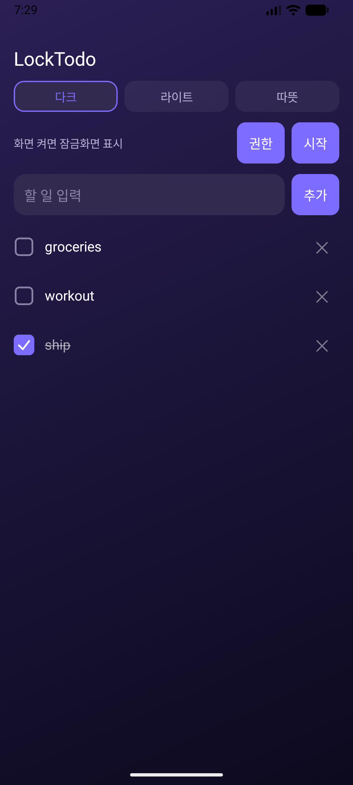
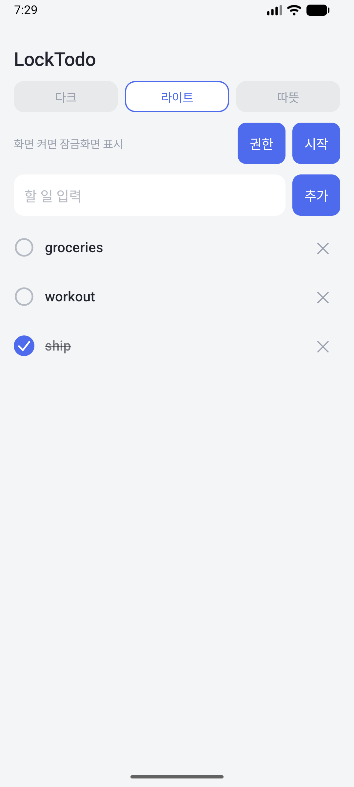
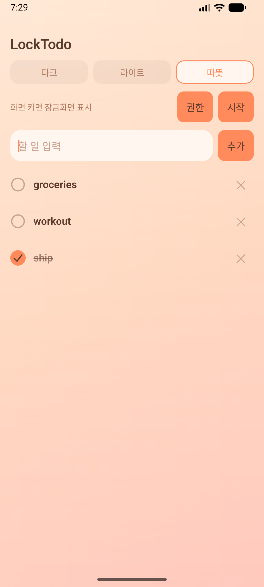
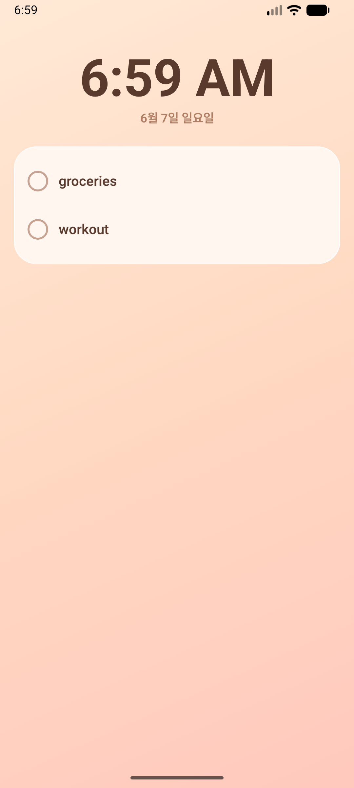
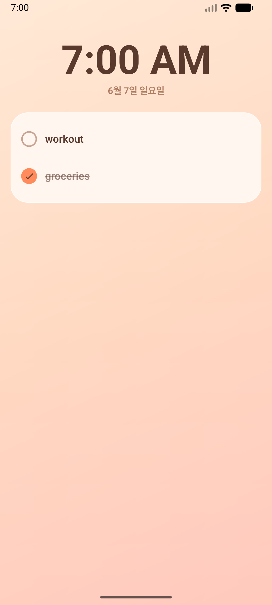

# LockTodo

잠금화면을 풀지 않고도 할 일을 보고 **바로 체크**하는 안드로이드 앱입니다. 화면을 켜면 잠금화면 위에 시계와 할 일이 떠서, 폰을 들 때마다 확인하고 완료할 수 있습니다.

## 기능

- 할 일 **추가 / 삭제(+실행취소) / 체크** — 딱 이 세 가지에 집중 (날짜·우선순위 등 부가 속성 없음)
- **잠금 해제 없이** 잠금화면 위에서 체크
- 잠금화면 **시계**(시스템 시각·12/24h 자동) + 날짜
- **3가지 테마**(다크 / 라이트 / 따뜻) 선택, 즉시 반영

## 데모

### 3가지 테마 (메인)
| 다크 | 라이트 | 따뜻 |
|---|---|---|
|  |  |  |

### 잠금화면 (잠금 해제 없이)
| 시계 + 할 일 | 무잠금 체크 |
|---|---|
|  |  |

## 동작 방식

- 상주 포그라운드 서비스가 화면 켜짐(`ACTION_SCREEN_ON`)을 감지합니다.
- **잠금 상태일 때만**(`KeyguardManager` 가드) `showWhenLocked` 액티비티를 잠금화면 위에 띄웁니다. 잠금이 아니면 띄우지 않습니다.
- `SYSTEM_ALERT_WINDOW` 권한으로 백그라운드 액티비티 시작 제한(BAL)을 통과하고, 막히면 `fullScreenIntent` 알림으로 대체합니다.
- 그 화면 안의 체크박스는 잠금 해제 없이 토글됩니다.

> 잠금화면 위젯 방식은 탭하면 잠금 해제를 요구해 "무잠금 체크" 목표에 맞지 않아 쓰지 않았습니다.

## 기술

- Kotlin + **Jetpack Compose**
- 테마는 `AppTheme` 토큰 시스템(`LocalAppTheme` CompositionLocal) — 색·radius·weight를 토큰으로 분리, 컴포넌트는 토큰만 읽음
- 시계는 `ACTION_TIME_TICK` 부분 갱신(전체 recompose 없음), WCAG AA 대비 통과 색
- minSdk 27 / targetSdk 36 (Android 16), 검증 에뮬 `Medium_Phone_API_36.1`

## 만든 과정

기능만 있던 1차 버전에서, **4개 페르소나(비주얼 디자이너 · UX · 안드로이드 엔지니어 · Devil's Advocate) 디자인 리뷰를 여러 라운드** 돌려 수렴시킨 뒤 Compose로 리팩터링했습니다. 마지막에 Devil's Advocate 4-pass로 "결정이 코드에 실제 반영됐는지"까지 검증했습니다. 전 과정·결정 로그는 [`.dev/design/`](.dev/design/)에 있습니다(`SPEC-design.md`, `design-tokens.md`, `decisions.md`, 라운드별 리뷰).

## 실행

```bash
./gradlew assembleDebug
adb install -r app/build/outputs/apk/debug/app-debug.apk
adb shell appops set com.example.locktodo SYSTEM_ALERT_WINDOW allow
adb shell pm grant com.example.locktodo android.permission.POST_NOTIFICATIONS
adb shell am start -n com.example.locktodo/.MainActivity
```

앱에서 **권한 → 시작** 순서로 누른 뒤, 화면을 끄고 켜면 잠금화면에 표시됩니다.

## 상태

기능·안정성은 완료(추가/삭제/체크/Undo/잠금화면 자동표시/시계/3테마 전환 에뮬 검증). 일부 디자인 정밀(상태 토큰·테마 전환 모션 등)은 [`decisions.md`](.dev/design/decisions.md)의 FIX 목록으로 추적 중입니다.
