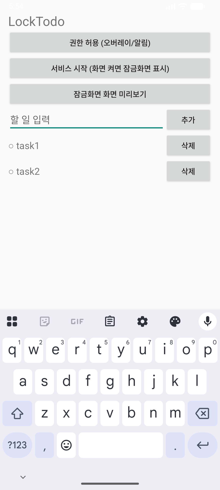
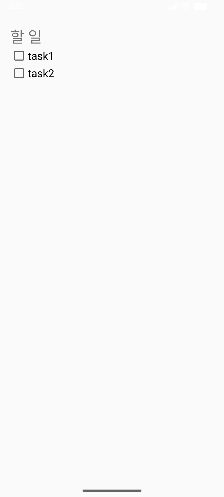
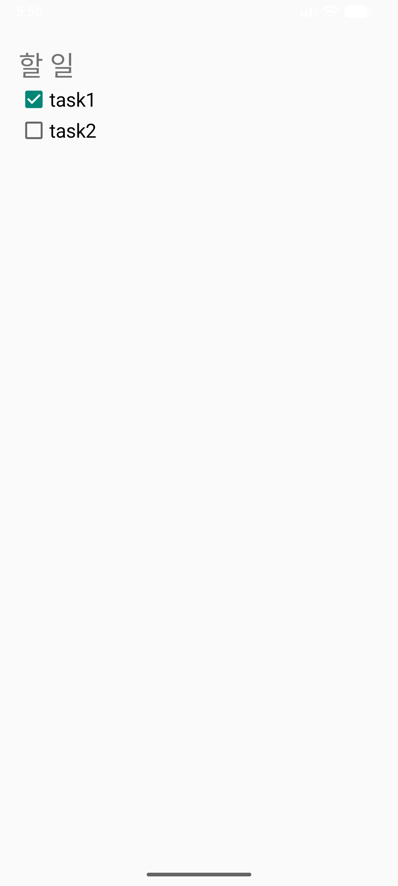
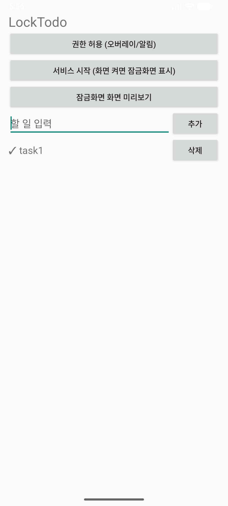

# LockTodo

잠금화면을 풀지 않고도 할 일을 보고 바로 체크하는 안드로이드 앱입니다. 화면을 켜면 잠금화면 위에 할 일 목록이 떠서, 폰을 들 때마다 확인하고 완료할 수 있습니다.

## 기능

- 할 일 **추가** (텍스트)
- 할 일 **삭제**
- 할 일 **체크**(완료 토글) — 잠금 해제 없이 잠금화면 위에서

부가 속성(날짜·기한·우선순위 등)은 두지 않았습니다. 추가/삭제/체크에 집중합니다.

## 동작 방식

- 상주 포그라운드 서비스가 화면 켜짐(`ACTION_SCREEN_ON`)을 감지합니다.
- 화면이 켜지면 `showWhenLocked` 액티비티를 잠금화면 위에 띄웁니다. `SYSTEM_ALERT_WINDOW` 권한으로 백그라운드 액티비티 시작 제한을 우회합니다.
- 그 화면 안의 체크박스는 잠금 해제 없이 토글됩니다.

위젯 방식은 탭하면 잠금 해제를 요구해 "무잠금 체크" 목표에 맞지 않아 쓰지 않았습니다.

## 실행

```bash
./gradlew assembleDebug
adb install -r app/build/outputs/apk/debug/app-debug.apk
adb shell appops set com.example.locktodo SYSTEM_ALERT_WINDOW allow
adb shell pm grant com.example.locktodo android.permission.POST_NOTIFICATIONS
adb shell am start -n com.example.locktodo/.MainActivity
```

앱에서 "권한 허용" → "서비스 시작" 순서로 누르면 됩니다.

## 환경

- Kotlin / Android (minSdk 27, targetSdk 36)
- 검증: 에뮬레이터 `Medium_Phone_API_36.1` (Android 16)

## 데모

| 추가 | 잠금화면 표시 | 체크 | 삭제 |
|------|----------|------|------|
|  |  |  |  |

자세한 설계는 [SPEC.md](./SPEC.md) 를 참고해 주세요.
